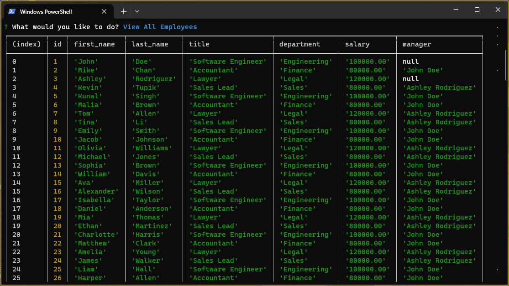

# Employee Tracker
  
  
  ## Description
  Employee tracker is a easy-to-use CLI tool, that stores information about your employees in a MySQL database.
  [Link to demo video](https://youtu.be/LdrJFA6j0gk)
  ## Table of Contents
  - [Installation](#installation)
  - [Usage](#usage)
  - [License](#license)
  - [Contributing](#contributing)
  - [Tests](#tests)
  - [Questions](#questions)
  ## Installation
  ```npm i```
  ## Usage
  Ensure that you have the schema sourced and seeded.
  1. Connect to your MySQL instance
  ```mysql -u root -p```
  2. Enter your instance password
  3. Source the schema.sql and seeds.sql files
  - ```source ./db/schema.sql```
  - ```source ./db/seeds.sql```
  
  After setup is complete, run the following command to start the application.
  ```node ./index.js```
  
  ## Contributing
  Contributions are welcome! Please create a pull request or issue and let's talk.
  ## Questions
  If you have any questions, please contact me at blockdoyle.
  ### GitHub Profile
  [blockdoyle](https://github.com/blockdoyle)
  ### Email
  [blockdoyle@gmail.com](mailto:blockdoyle@gmail.com)
